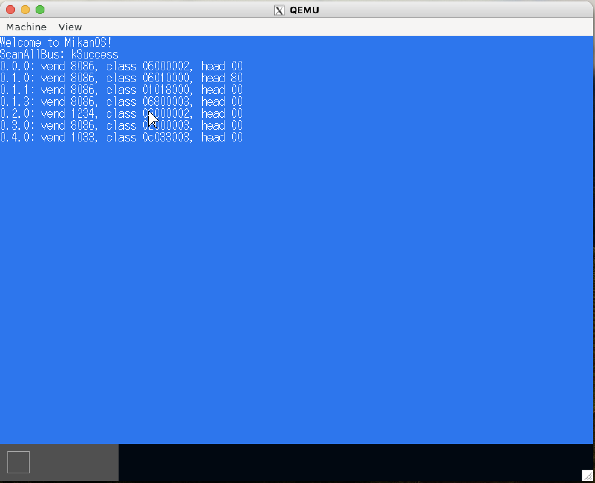
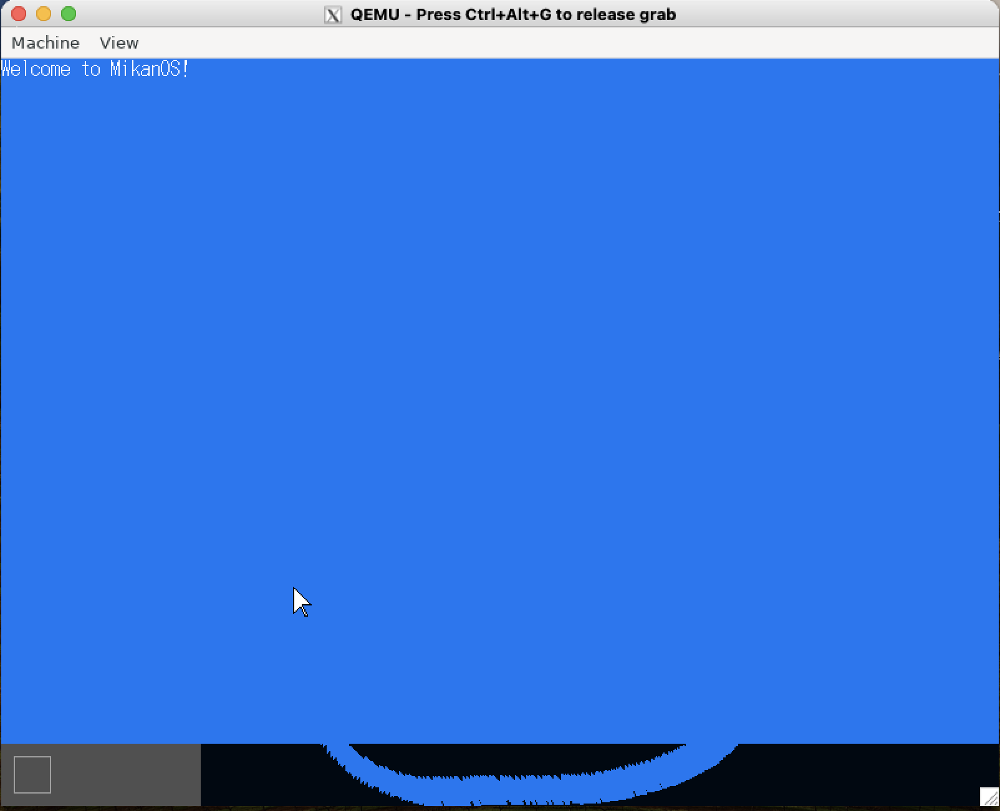
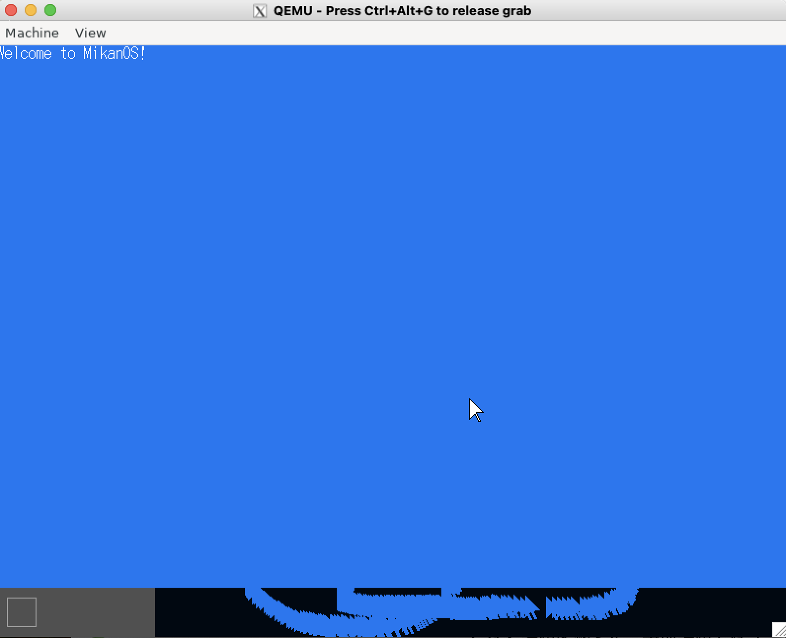

# 日記

### Day02

BootLoaderのビルドのためにedk2の設定を2箇所書き換える必要がある。

- ビルドターゲット設定：edk2/Conf/target.txt（みかん本参照）
- クロスコンパイル設定：edk2/Conf/tools_def.txt（[参照](https://github.com/sarisia/mikanos-docker?tab=readme-ov-file#m1-mac-%E3%81%A7%E3%81%AE%E5%8B%95%E4%BD%9C%E3%81%AF)）

メモリマップをUEFI経由で取得し、特定のメモリ領域に格納。
その後、これまたUEFIの機能を使ってメモリマップの情報をcsv形式で出力。UEFIは割と何でもできる（気がする）。
OSがあればシステムコールを使ってファイルの入出力をするけど、UEFIを使ってファイル操作できるのは驚き。
BootLoaderで出力したcsvファイルは`disk.img`をマウントして確認可能。

### Day03

やっとカーネルを起動する。
BootLoaderのプログラムからUEFI経由でkernel.elfをメモリにロードし、実行の権限をカーネルに移す。

UEFIの機能を使って画面描画をする。
フレームバッファの開始アドレスを取得した後、ピクセル毎に値を書き込む。

UEFIで取得したフレームバッファの情報をカーネルに渡し、カーネル側で画面描画を出来るようにした。

エラーが起きた時に画面にメッセージを出力しておいて以降はhaltするようにした。

### Day04

カーネルのビルドをMakefileに移行。

ピクセルの色彩情報方法を変更。
WritePixel関数を使うことで座標+RGB情報で描画可能に。

ピクセルを描画する処理にC++のクラスを使用。
いよいよC++っぽくなってきた。
まだmallocなどのシステムコールを使用できないため、new演算子のオーバーロードと静的な領域確保によってクラスのインスタンス作成を行う。

BootLoaderを改良した。
元々ELFファイルをそのまま特定のメモリ領域にコピーしていたところ、ELFファイルのプログラムヘッダの情報を基にコピーするように変更。
ELFファイルの情報をもう少し理解したいなあ...

### Day05

`A`のフォントを用意して画面に描画できるようになった。

リファクタリングして機能毎にファイルを分割。
Makefileの書き方はもう少し学ぶ必要あり。

フォントを追加。
テキストファイルからどうやってフォント情報をカーネルに教えるのかなと思っていたが、一旦バイナリにしてからobjcopyコマンドでobjectファイルに変換し、リンクすると他のプログラムから見えるようになるらしい。
他のプログラムからはobjcopyが命名する変数名（`_binary_hankaku_bin_start`など）を使うと操作可能。
これは面白い。

文字列描画とsprintfを追加。

コンソールを出力できるようになった！

printkでカーネル内から気軽に文字列を出力できるようになった。

### Day06

マウスとかバーとかを描画。OSのGUIぽくなってきた。

PCに登録されているPCIデバイスを全て検出することに成功。
IOアドレス空間に存在する全てのバス・デバイス・ファンクションにおけるPCIコンフィギュレーションを取得し出力する。

PCIデバイス(xHCIコントローラ)経由でマウスがつながっているUSBポートを監視し、マウスの動きを描画するようになった。
現状マウスの動きは割り込みではなくポーリング。
カーソルの軌跡は単色で塗りつぶしているため変な跡が残る。

### Day07

マウスの動きをポーリングではなく割り込みで実行するように変更。
流れとしては以下の通り。

前処理
1. IDT(Interrupt Descriptor Table)を用意し割り込みハンドラを登録する
2. lidt命令で用意したIDTのアドレスをCPUに渡す（IDTRレジスタで持つらしい）
3. xHCのMSI割り込みを有効化する
    - MSI割り込みはメモリ上の特定のアドレス(Message Address)に特定の値(Message Data)を書き込むことによってCPUに割り込み信号が伝わる仕組みを持つ
    - Message Addressには割り込みを受信するプロセッサのコアを指定し、Message Dataには割り込みベクタ(IDT上の番号)を指定する
    - よって、xHCのドライバ経由でこのあたりのデータをxHCに登録する処理を行う
4. 割り込みを有効化する

割り込み時の動作
1. マウスが動くなどして割り込み信号がxHCに伝わる
2. xHCはメモリ上のMessage Address(特定のCPUコアの番号を含む)に対してMessage Data(割り込みベクタの番号を含む)を登録する
3. CPUに対して割り込み信号が伝わりCPUが割り込みモードに入る
4. CPUは前もってもっているIDTのアドレスを元に実行すべき割り込みハンドラを特定し実行する

今まで割り込みを調べてもあまり腑に落ちていなかったが、今回で完全に理解した()
割り込みはCPUのレジスタやメモリ領域、xHCなどのハードウェア的な視点を持つと理解しやすい。
一般的にメモリはCPUが順に読んでいくものだと思っていたが、割り込みの文脈ではただCPUに対して電気信号を送るだけのメモリ領域も存在することがわかった。

実際にマウスが動いたのが以下の図。
まあ中身が変わっただけなのでDay06と見た目は変わらない。

割り込みの高速化を実装。
割り込みハンドラ内で重たい処理をしているとその間他の割り込みがブロックされるため割り込みを見逃すことになる。
それを防ぐために割り込みハンドラ内では割り込みメッセージをキューに格納するだけに留め、main内でキューを監視しておくことで高速化する。

### Day08a

BootLoaderからKernelMainに対してメモリマップ構造体を渡し、中身を出力する。

BootLoaderからメモリマップの権限を受け取るに当たって以下の3つのデータを書き換えられない領域に置き換える必要がある。

- スタック領域
    - 静的に領域を確保し、スタックポインタRSPの値を書き換える
- GDT(Global Descriptor Table)
    - 元々GDTはセグメンテーション用のデータ領域だがx86-64の64ビットモードではCPUの動作権限を設定するためのみに使用する。必要最低限の設定だけしておいてGDTのアドレスをレジスタに登録する。
- ページング
    - x86-64の64ビットモードではページングの利用が必須である。プログラム上でアドレスを指定してアクセスしようとするとCPUが勝手に階層ページング構造からアドレスを変換し物理アドレスに変えてくれる。そのため、階層ページング構造を作成しそのア先頭ドレスをCR3レジスタに書き込む。階層ページング構造は `pml4_table` -> `pdp_table` -> `page_directory` の順に階層化されている。今回はプログラム上でのアドレス表記と実際にアクセスされるアドレスが等しくなるアイデンティティマッピングを採用。

メモリの使用可能領域を判定するビットマップメモリマネージャーを作成。
メモリ領域をページフレーム4KiB毎に分割し、それぞれのページフレームが使用可能領域かどうか判断する。
メモリマネージャはUEFIから渡されたメモリマップの情報を元にメモリの初期状態を設定する。

### Day09a

GUI上に表示する物をレイヤに分けて管理する。
今まではカーソルを動かすと軌跡が残ってしまっていたが、一番下のレイヤから順に再描画することでマウスの軌跡が残らないようにした。

マウスを動かした時にチラチラするため改善する。
タイマー（Local APIC タイマ）を使って測定。
大体動かす毎に10,000,000前後くらい要していた。
